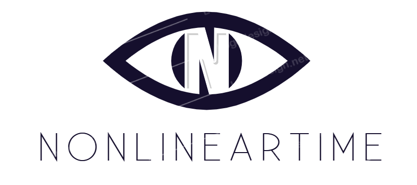
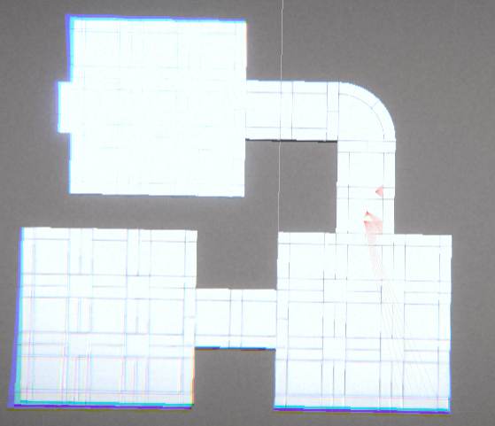
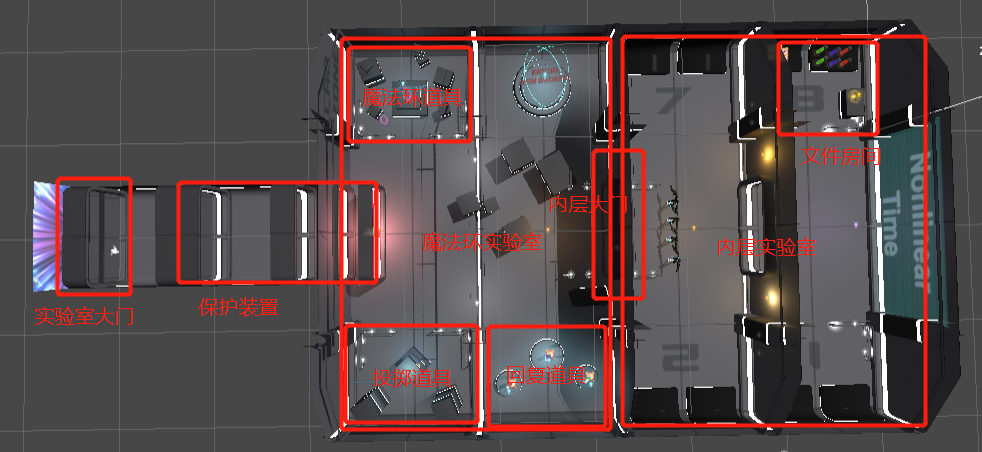
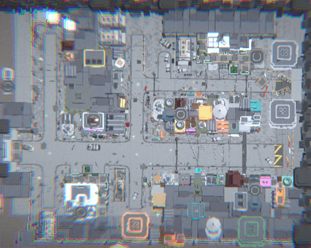
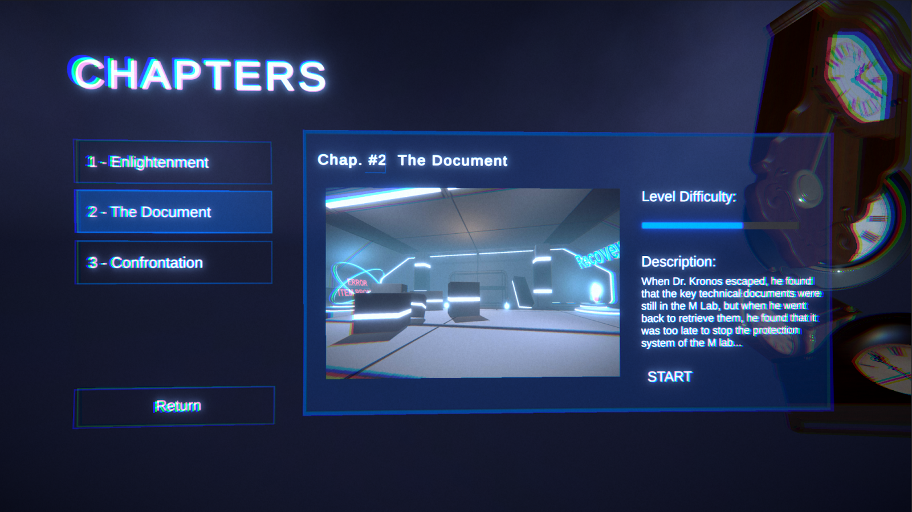
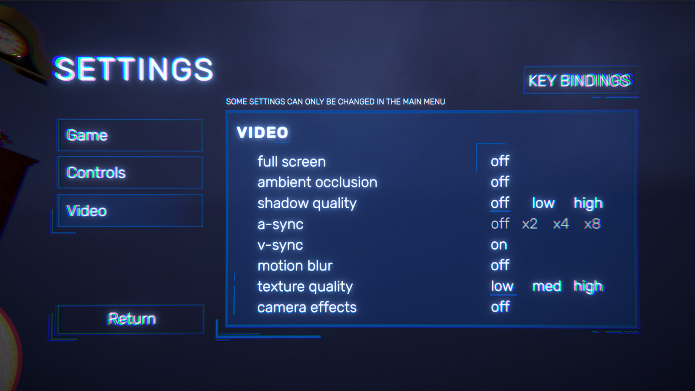
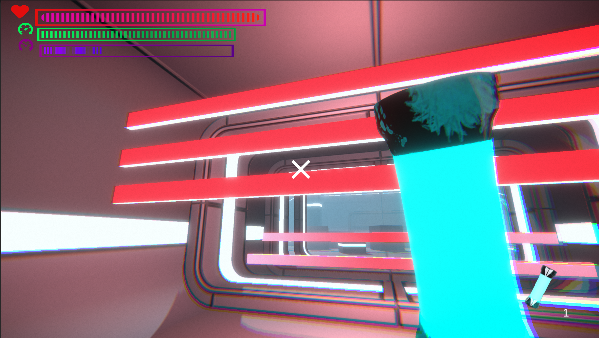
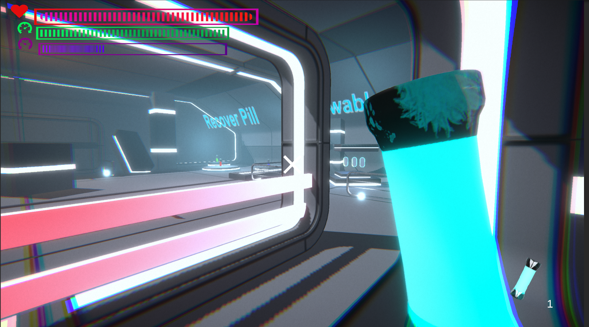
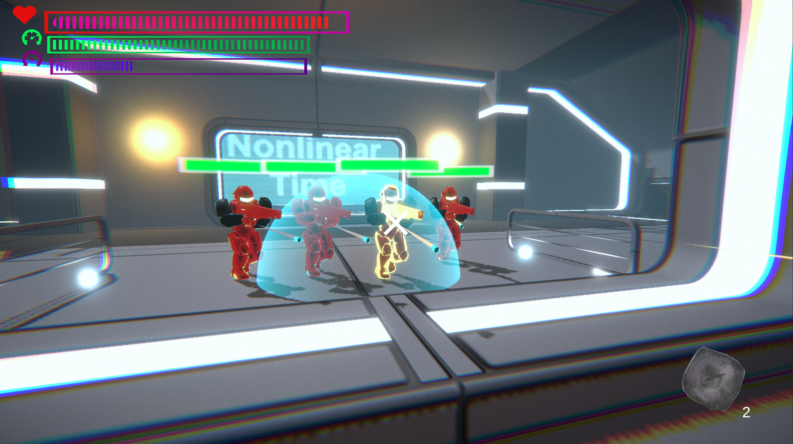

# 🕰️ Nonlinear Time 非线性时间 
This repository is a course project of game design course inn the School of Software (Media Arts and Sciences Direction) of Tongji University in the spring and summer semester of the 2020-2021. This project is supervised by teachers from Virtuos, and the dev team members are Kaibin Zhou, Mingzhe Zhang, Xiaoyu Qi, Xiaoyu Jia and Jiajie Li.

本仓库是同济大学软件学院（18级数字媒体方向）游戏脚本设计的课程项目。本项目由维塔士的各位老师指导完成，项目成员是周楷彬、张明哲、齐小钰、贾小玉和李嘉杰。

## 🔍 Introduction 游戏简介

### Overview 总览
「非线性时间」是一款第一人称解谜游戏。

*时间并不「流淌」，它不是河水，而是河床。符合因果顺序的事件在时间的河床中按一个方向排列，没有什么在流动。在这个令人绞尽脑汁的第一人称解谜游戏中，你将作为疯狂的科学家，利用时间控制的错觉改变事件因果，解决一道道看似不可能的谜题。感知即现实。*

*通过我们的 Slides 快速了解「非线性时间」做了什么*

[Slides English Version 👈](https://docs.google.com/presentation/d/1aidkKXJ6el329gLtfbOAd3ImpXXvzJOWCaSdS-iOhTg/edit?usp=sharing)
[中文版 Slides 👈](https://docs.google.com/presentation/d/1aidkKXJ6el329gLtfbOAd3ImpXXvzJOWCaSdS-iOhTg/edit?usp=sharing)

### Background 游戏背景

自命不凡的 M Lab 的主任偶然发现了操纵时间的技术，从此自称为 [克洛诺斯](https://en.wikipedia.org/wiki/Chronos) 博士，并以时间之神自居。克洛诺斯博士的技术允许他通过一根通电的光棒控制时间流向，并改变事件因果，进而把物体带入一个非线性的时间世界。

但与此同时，这项技术也给他惹来了许多不必要的「关注」和「麻烦」...

### Core Gameplay 核心设定

1. 「非线性时间」是一款第一人称视角解谜游戏
2. 「时间线」：每一个游戏中的物体都有一条独立的时间线，且可以被控制
3. 「感知即现实」：游戏中所有的事件因果结算都以玩家视角的感知作为最终判定依据
4. 「无直接伤害」：玩家没有直接对敌人造成伤害的手段（如枪械，近战武器 etc.），只有利用恰当时间机制才能击败敌人并推进游戏进度
5. 「资源有限」：资源是有限的，如果资源利用不当将导致无法解开后续谜题

## 🗺️ Beginner's Guide Design 新手引导设计

 

## 🕹️ Level Design 关卡设计

### Chapter 1 Enlightenment 启迪

- Map 关卡平面图

  
- Storyline 剧情

  ​	克洛诺斯博士在实验室中发现了操纵时间的技术。狂放不羁的性格让他引得了许多关注，同时也让他因此惹祸上身。克洛诺斯博士在后悔之余决定带着他的研究从M Lab出逃。

- Process 关卡流程

  1. 博士从实验室醒来，捡起地上的光棒，在一阵眩目强光之后，整个世界的时间流逝变得异常缓慢。

  2. 博士在实验室中探索，尝试用光棒控制时间，比如让小球的速度减慢、加速或者逆流上升。

  3. 博士打开大门，迎接第一波敌人。

  4. 博士通过控制敌人的速度和子弹的速度，让敌人互相残杀，或者让子弹逆流或敌人加速，而使敌人被自己的子弹杀死。

  5. 博士杀死敌人后，顺着通道到达第二个房间门口，在门口捡起地上的药物，回复HP或MP。

  6. 博士进入第二个房间，房间里有大量敌人，博士来不及反应大门就被关上了，博士必须在封闭的房间里迎战第二波敌人。

### Chapter 2 The Document 那个文件
- Map 关卡平面图

  

- Storyline 剧情

  ​	在逃离途中，克洛诺斯博士突然回想起魔法环实验室（Ring Lab）中还有数份有关时间控制的关键技术文件的拷贝没有销毁。犹豫再三，博士选择进入魔法环实验室，取走技术文件。魔法环实验室本就是机密实验室，因此装备着自防御系统，博士已经来不及去关闭保护系统，只得硬闯魔法环实验室...

- Process 关卡流程

  1. 博士打开魔法实验室大门后，实验室自动保护装置启动，红外射线占满通道向博士移动。如果碰到红外射线，博士将被灼烧至死。

  2. 博士通过回溯能力避开红外射线，进入实验室。

  3. 博士在实验室中获得 魔法道具——魔法环（Magic Ring），获取可以投掷的物品，以及回复生命、回复加速魔力、回复减速魔力的药丸。

  4. 博士走过所有物品介绍后，打开实验室内层大门。内层大门打开后迎接第一波敌人。

  5. 博士可以通过时间控制的组合消灭敌人。

     a.  将敌人加速，射出的子弹减速，诱导敌人被子弹射中

     b.  将射出的子弹回溯，击中回溯路径上的敌人

     c.   将敌人减速，扔出物品加速，通过时间流速不同的伤害增幅消灭敌人

     d.  将敌人加到高速，在子弹射出后敌人将直接命中自己

  6. 将第一波敌人消灭后，博士进入实验室内部，找到并拿取关键技术文件。在关键技术文件房间有各种回复道具以及投掷道具。

  7. 离开关键技术文件房间后，将迎接第二波敌人。

  8. 第二波敌人刷出后，博士可以选择将所有敌人消灭后离开， 或者在房间内躲过敌人攻击，逃到魔法环实验室入口。

  9. 博士重新打开魔法环实验室大门，进入传送门，进入第三关。

### Chapter 3 Confrontation 冲突
- Map 关卡平面图

- Storyline 剧情

  ​	洛诺斯博士从魔法环实验室逃离出来，来到实验室外的街道上，发这里的敌人比实验中更多，也更危险。看起来，一场正面冲突是在所难免的了..

- Process 关卡流程

  ​	将时间控制与道具配合使用，解开谜题，击败敌军。全歼敌军后，穿过地图中出现的光门，即成功通关该章节。

  

## 🖥️ Screenshots 游戏截屏

## 🗄️ Project Structure 项目结构
* `Assets`
  * `Animation`：动画相关，Animation和Animator Controller
  * `Ludiq`：Chorons插件
  * `Materials`：材质和shader
  * `Models`：模型
  * `Packages`：第三方Packages
  * `Plugins`：DOTween插件
  * `Prefabs`：预制体
  * `Resources`：DOTween设置文件
  * `Scenes`：场景
  * `Scripts`：C#脚本
  * `Settings`：光照设置文件
  * `Sprites`：2D图片

## 🔫 System Requirements 系统需求

* **运行系统**
  - Windows 10
  - macOS Catalina 10.15+

## 🛠️ Dev Environment 开发环境

* **开发引擎**：Unity 2020.2.3.f1
* **开发语言**：C#

## 👨‍👩‍👧‍👦 Dev Team 制作团队

|  学校  |  学号   |  姓名  |
| :----: | :-----: | :----: |
| Tongji | 1851197 | 周楷彬 |
| Tongji | 1852452 | 张明哲 |
| Tongji | 1851605 | 齐小钰 |
| Tongji | 1851620 | 贾小玉 |
| Tongji | 1750655 | 李嘉杰 |

## 📊 Gantt Chart 甘特图

