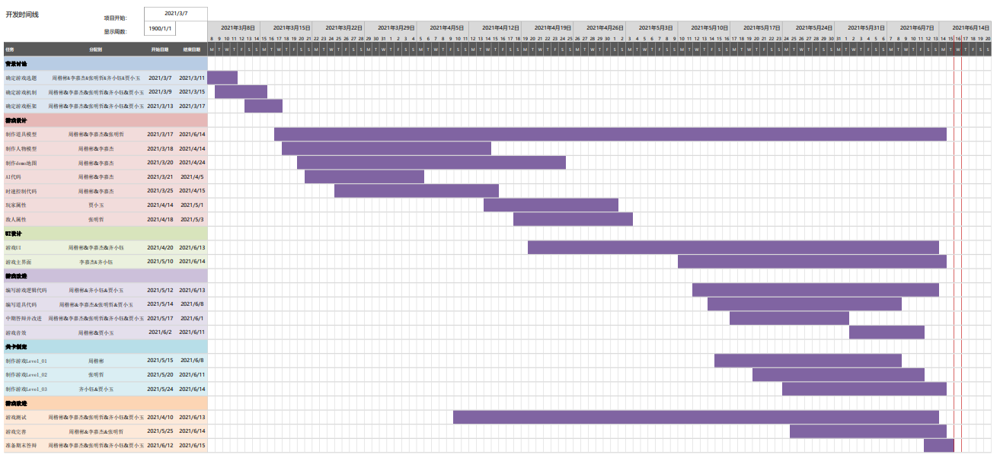
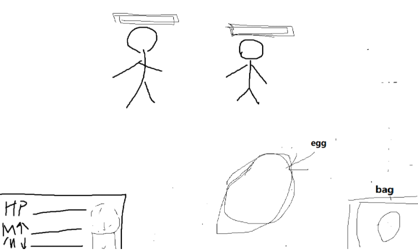

# 🕰️ Nonlinear Time 非线性时间 

## 🔍Introduction 游戏简介
### 🗺️Overview 总览
「非线性时间」是一款第一人称解谜游戏。

*时间并不「流淌」，它不是河水，而是河床。符合因果顺序的事件在时间的河床中按一个方向排列，没有什么在流动。在这个令人绞尽脑汁的第一人称解谜游戏中，你将作为疯狂的科学家，利用时间控制的错觉改变事件因果，解决一道道看似不可能的谜题。感知即现实。*

*通过我们的 Slides 快速了解「非线性时间」做了什么*

[Slides English Version 👈](https://docs.google.com/presentation/d/1aidkKXJ6el329gLtfbOAd3ImpXXvzJOWCaSdS-iOhTg/edit?usp=sharing)
[中文版 Slides 👈](https://docs.google.com/presentation/d/1aidkKXJ6el329gLtfbOAd3ImpXXvzJOWCaSdS-iOhTg/edit?usp=sharing)

## 游戏背景

## 游戏设定

## 关卡设计

- 第一关，获得加速能力

  - 投掷加速的鸡蛋杀死敌人

- 第二关，获得减速能力

  - 投掷加速的鸡蛋杀死减速了的高速敌人

- 第三关，获得逆流能力

  - 使敌人的子弹逆向射击杀死敌人

- 第四关习得区域控制（不消耗能量，消耗道具）

  - tbd

- 第五关正式关卡

  

- 第1关

  - 能力：加速/减速

  - 流程：醒来，捡起棒，UI介绍背景，有道具演示加速/减速能力，敌人进来，打败敌人，在第二个房间出去，切换到第2关

    - 黑屏，睁开眼睛，摄像机朝天花板，站起来，旁白“我怎么了”之类的

    - 环顾四周，发现地上有棒，捡起来，时间变慢，配合屏幕效果(一瞬间强光？)/音效(轰)

    - 在房间里的道具演示加速减速，钟摆变慢，方块在风场里变快

    - 演示完，视角聚焦门，敌人破门而入，屏幕暂停，提示开始战斗

- 第2关

  - 能力：逆向

  - 流程：一堵墙，不得不使用逆向

- 第3关

  - 光圈

  - 法力耗尽，大量敌人

- 第4关

  - 正式关卡

## 开发时间线

## 游戏截屏

## 项目结构
* `Assets`
  * `Animation`：动画相关，Animation和Animator Controller
  * `Ludiq`：Chorons插件
  * `Materials`：材质和shader
  * `Models`：模型
  * `Packages`：第三方Packages
  * `Plugins`：DOTween插件
  * `Prefabs`：预制体
  * `Resources`：DOTween设置文件
  * `Scenes`：场景
  * `Scripts`：C#脚本
  * `Settings`：光照设置文件
  * `Sprites`：2D图片

## 运行环境

* **运行系统**
  - Windows 10
  - macOS Catalina 10.15+

## 开发环境

* **开发引擎**：Unity 2020.2.3.f1
* **开发语言**：C#

## 制作团队

|  学校  |  学号   |  姓名  |
| :----: | :-----: | :----: |
| Tongji | 1851197 | 周楷彬 |
| Tongji | 1852452 | 张明哲 |
| Tongji | 1851605 | 齐小钰 |
| Tongji | 1851620 | 贾小玉 |
| Tongji | 1750655 | 李嘉杰 |
